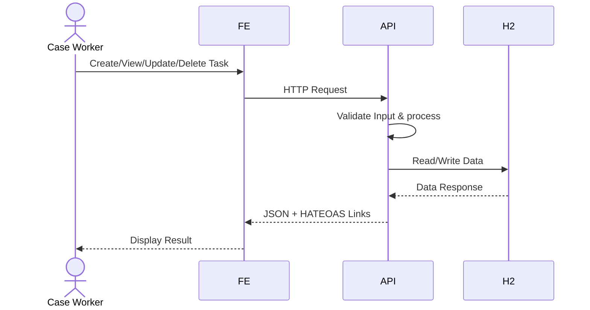

# Swagger API Specification
- [OpenAPI Specification](./OpenAPISpecification.json) - The API specification file
- [Swagger Editor](https://editor.swagger.io/) - View online
- [Swagger UI](http://localhost:4000/swagger-ui/index.html#/) - Interactive API for local

## Build status 
### Backend

### High level flow

## Performance/ improvements
## TODO 
